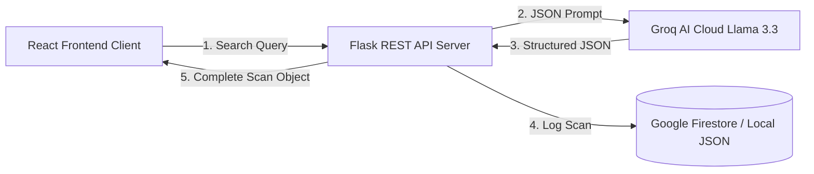

# Sustainable Waste Management Assistant Using Generative AI

EcoSense is an AI-powered civic platform designed to help citizens identify household waste items, discover step-by-step sorting instructions, locate nearby dropoff facilities via maps, and monitor recycling progress. 

This repository is structured according to the **AI Specialist Track Project Template** standards, organized into 8 distinct engineering lifecycle stages.

---

## 🌟 Key Features

* 🧠 **AI-Powered Waste Scanner**: Type any household item and get instant classification (Plastic, Metal, Organic, E-waste, Hazardous, etc.) powered by **Llama-3.3-70B via Groq**.
* 🗺️ **Interactive dropoff Map**: A Leaflet.js map with custom SVG markers pinning local recycling hubs, hazardous waste centers, and compost points.
* 📊 **Analytics Dashboard**: Chart.js charts showing Doughnut distributions (recyclable vs non-recyclable), Bar charts (scans per category), and Line graphs (weekly trends).
* 📜 **Automatic History Logger**: Saves previous scans automatically in your history stack, with features to delete single scans or wipe all history.
* 🛡️ **Offline Fallback Engine**: Fully resilient backend database service. If Groq API keys or Firestore credentials are not set, it switches to a local JSON database and heuristics engine without throwing exceptions.

---

## 📂 Repository Structure

The folders in this repository correspond directly to the required stages of the AI Specialist engineering track:

* 📁 **[1. Brainstorming & Ideation](file:///C:/Users/sande/.gemini/antigravity/scratch/Sustainable-Waste-Management-AI-Assistant/1.%20Brainstorming%20&%20Ideation/)**: Prioritization metrics, Empathy Maps, and user problem definitions.
* 📁 **[2. Requirement Analysis](file:///C:/Users/sande/.gemini/antigravity/scratch/Sustainable-Waste-Management-AI-Assistant/2.%20Requirement%20Analysis/)**: Functional/Non-Functional requirements, Level 0/1 Data Flow Diagrams (DFD), and Customer Journey Maps.
* 📁 **[3. Project Design Phase](file:///C:/Users/sande/.gemini/antigravity/scratch/Sustainable-Waste-Management-AI-Assistant/3.%20Project%20Design%20Phase/)**: Problem-Solution Fit Matrix.
* 📁 **[4. Project Planning Phase](file:///C:/Users/sande/.gemini/antigravity/scratch/Sustainable-Waste-Management-AI-Assistant/4.%20Project%20Planning%20Phase/)**: WBS planning timeline and milestones.
* 📁 **[5. Project Development Phase](file:///C:/Users/sande/.gemini/antigravity/scratch/Sustainable-Waste-Management-AI-Assistant/5.%20Project%20Development%20Phase/)**: Code files for backend (Flask) and frontend (React).
* 📁 **[6. Performance Testing](file:///C:/Users/sande/.gemini/antigravity/scratch/Sustainable-Waste-Management-AI-Assistant/6.%20Performance%20Testing/)**: Unittest suite logs and API load test reports.
* 📁 **[7. Documentation & Demo](file:///C:/Users/sande/.gemini/antigravity/scratch/Sustainable-Waste-Management-AI-Assistant/7.%20Documentation%20&%20Demo/)**: Deploy links, installation manuals, video demo guides, and official report staging folders.
* 📁 **[8. Project Demonstration](file:///C:/Users/sande/.gemini/antigravity/scratch/Sustainable-Waste-Management-AI-Assistant/8.%20Project%20Demonstration/)**: Scalability roadmaps, environmental impact statements, and live website UI screenshots.

> [!NOTE]
> All document stages are compiled as professional **SmartBridge / SkillWallet styled PDF worksheets** complete with headers, date/team metadata grids, and maximum mark indicators.

---

## 🌐 Live Application Links

* **Live Unified Web Application (Render)**: 
  👉 **[https://sustainable-waste-management-amrn.onrender.com/](https://sustainable-waste-management-amrn.onrender.com/)**
  *(Serves the compiled React frontend statically and proxies API queries to `/api/*`)*
* **Live Static Frontend Client (GitHub Pages mirror)**: 
  👉 **[https://lokeshkodamanchili.github.io/Sustainable-Waste-Management/](https://lokeshkodamanchili.github.io/Sustainable-Waste-Management/)**
* **Flask API Health Check**: 
  👉 **[https://sustainable-waste-management-amrn.onrender.com/api/health](https://sustainable-waste-management-amrn.onrender.com/api/health)**

---

## 🏗️ System Dataflow Architecture



---

## 🚀 Quick Local Setup Guide

Follow these steps to run the application locally on your machine:

### 1. Backend Server Setup
Navigate into the backend directory and configure the Python environment:
```bash
# Go to backend folder
cd "backend"

# Create a virtual environment
python -m venv venv

# Activate virtual environment
# On Windows:
.\venv\Scripts\Activate.ps1
# On macOS/Linux:
source venv/bin/activate

# Install dependencies
pip install -r requirements.txt

# Run the Flask API server
python app.py
```
The backend server will run on `http://127.0.0.1:5000`.

> [!TIP]
> Copy `.env.template` to `.env` inside the `backend` folder to add your custom `GROQ_API_KEY` or `FIREBASE_KEY`. If left blank, the app runs automatically in offline fallback mode!

### 2. Frontend Client Setup
Open a separate terminal window and configure the React Vite client:
```bash
# Go to frontend folder
cd "frontend"

# Install node dependencies
npm install

# Run the development server
npm run dev
```
Open your browser to `http://localhost:5173`.

### 3. Initialize Demo Data
* Once the site loads, click the **Settings** tab on the navigation menu.
* Click the **Seed Sample Dataset** button.
* This will immediately populate your local scan history database and charts with realistic waste logs!
